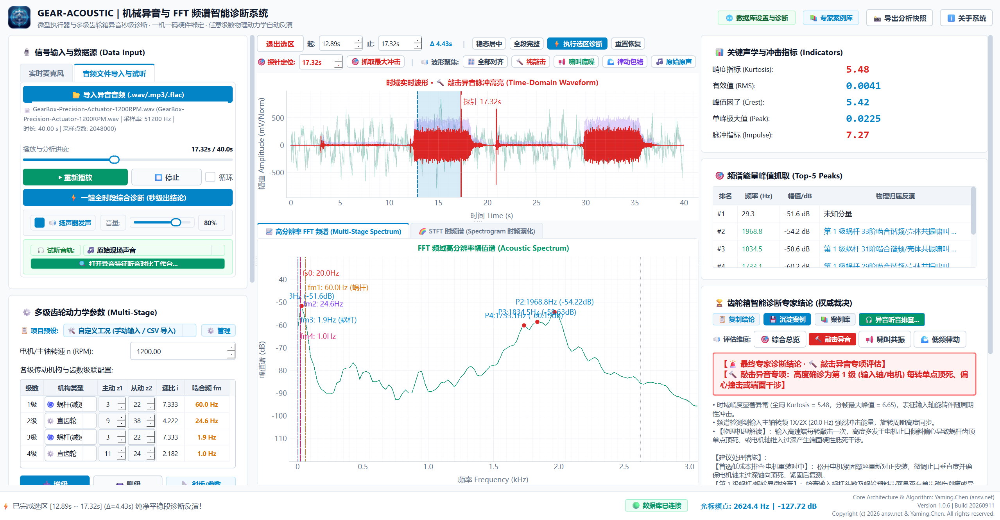
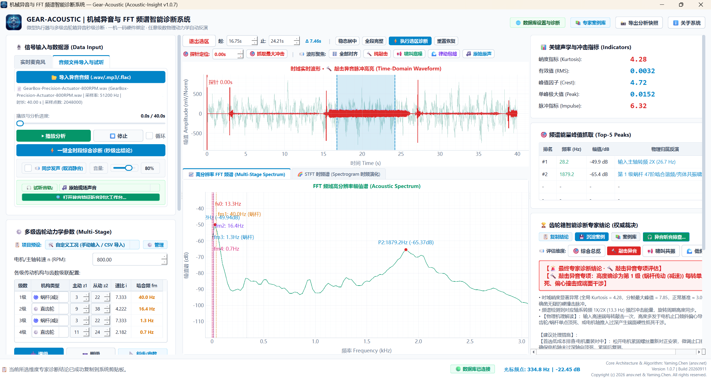
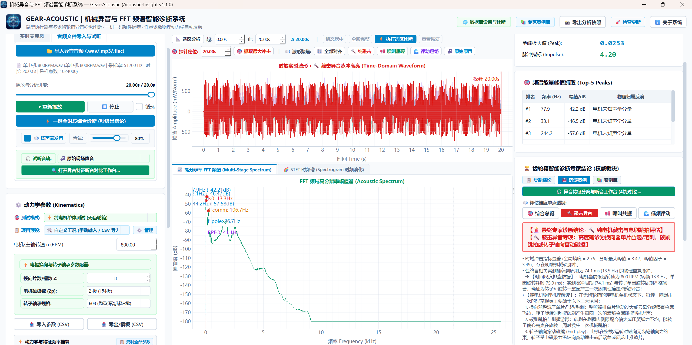

<div align="center">

# ⚙️ Gear-Acoustic 机械异音与多级传动 FFT 频谱智能诊断系统
### Industrial NVH Acoustic & Vibration Intelligent Diagnostic Workstation

[](https://github.com/tonychen5577-tech/gear-acoustic-releases/releases)
[-0284C7)](https://github.com/tonychen5577-tech/gear-acoustic-releases)
[](https://github.com/tonychen5577-tech/gear-acoustic-releases)
[](https://github.com/tonychen5577-tech/gear-acoustic-releases)
[](https://ansv.net)

<p align="center">
  <b>专为精密减速器、车载微型执行器、工业齿轮箱及旋转机械量身打造的软硬件一体化声学与振动智能诊断工作站</b>
</p>

[📥 免费下载试用版](#-软件下载与部署) • [✨ 核心功能亮点](#-核心功能亮点) • [🔬 真实工程诊断案例](#-真实工程实战案例某高精微型多级减速执行器敲击异音闭环诊断) • [🎯 典型工业场景](#-典型工业应用场景) • [🔑 商业授权与试用申请](#-软件授权与试用流程) • [🎙️ 硬件推荐](#-硬件选型与测试推荐)

</div>

---

## 📖 系统简介

**Gear-Acoustic** 是一款面向工业现场、研发实验室与产线质检研发的**高精密机械异音与 FFT 频域智能诊断工作站**。

传统工业巡检过度依赖现场人员的“经验听音”，存在**主观性强、易受环境干扰、无法量化归档、排查责任界定模糊**等行业痛点。Gear-Acoustic 将**高精度动态信号采集、高分辨频域特征解算、微观时域脉冲敏感度量与专家机理推理**融为一体：

无需繁复配置，只需输入机械转速与各级传动参数，系统即可自动反演整套传动链的运动学特征频率，精准锁定敲击断齿、干涉挤压啸叫、侧隙打齿碰撞、换向器跳拍及结构共振异音的**故障级数与根因机理**，为机械传动系统的质量控制与故障溯源提供客观、量化、确定性的科学依据。

<p align="center">
  
  <br>
  <em>图 1：Gear-Acoustic 智能诊断工作站主界面 —— 某精密多级复合减速执行器 1200 RPM 额定工况敲击异音秒级专家诊断全景</em>
</p>

---

## ✨ 核心功能亮点

### 1. 任意级数复杂多轴动力学传动建模
- **任意级数拓展**：支持单级、两级、三级直至多级级联传动机构，自由动态增加或削减级数；
- **多元机构类型支持**：原生适配**普通圆柱直齿轮、斜齿轮、行星齿轮箱、蜗轮蜗杆减速机构（含特殊增速机构）**；
- **纯电机单体专项测控**：内置专有纯电机测试引擎，智能解调电机极对数、电枢换向片数、转子轴承物理阶次，实现电机本体与外接齿轮箱的同台解耦诊断；
- **全传动链特征频率智能推算**：实时根据输入轴转速解算各级轴系转速、单级传动比、整箱总速比及各级啮合基频（$f_m$），并在图谱中自动完成多层级物理标注。

### 2. 实时声学/振动采集与文件双模测控
- **工业级传感器直连**：支持专业测量传声器（声学麦克风）、声级计、IEPE 振动加速度传感器及多通道专业 USB 声卡设备；
- **低延迟高保真输入流**：超低延迟硬件缓冲驱动，毫秒级捕捉微弱突发冲击异常；
- **全格式离线深度诊断**：支持工程现场录制的 `.wav`、`.mp3`、`.flac`、`.ogg` 等主流无损与标准音频文件直接拖拽导入分析；
- **客观测谱 + 主观听音综合验证**：内置安全试听引擎与默认静音防护机制，支持声画同步播放、音量动态平滑调节与任意时间戳快速定位跳转。

### 3. 高分辨工业级 FFT 频域分析仪
- **多档位高密度分辨率**：提供 1024、2048、4096、8192 等全档位 FFT 窗长，满足低频微弱转频分辨与高频啸叫捕捉的多样化权衡；
- **专业窗函数选型体系**：集成 **Hanning（汉宁窗）、Hamming（汉明窗）、Flat Top（平顶窗）、Rectangular（矩形窗）**，底层自动完成相干功率损失归一化增益补偿，保证物理量纲绝对恒定；
- **Top-5 能量极值毫赫兹级捕捉**：全自动扫描全频段主导能量峰，突破频率 Bin 离散限制，精确定位至具体频率数值并自动反演物理来源。

### 4. 敏感时域冲击波形与全维物理指标
- **毫秒级微观示波器**：高刷新率平滑呈现瞬态机械振动波形与声压波动，支持自动选区聚焦与纯敲击脉冲红色高亮增强；
- **敏感状态指标全维度量**：
  - **峭度 (Kurtosis)**：对单齿断齿、磕碰凹坑、毛刺、接触干涉等离散周期性脉冲冲击极度敏感，实现故障早期预警；
  - **峰值因子 (Crest Factor)**：脉冲极值与有效值比率，直观反映波形离散尖锐程度；
  - **有效值 (RMS) 与单峰极大值 (Peak)**：综合度量异音能量等级与冲击烈度。

### 5. 典型机械异音智能专家机理诊断引擎
系统内嵌成熟的机械传动声学机理规则体系，全面替代人工经验盲猜：
- **【转频冲击异常】**：精确定位齿轮单齿磕碰、断齿、模具压伤或周期性外物挤压敲击，明确指示出具体故障级数；
- **【啮合频率异常】**：准确识别齿顶干涉、侧隙过小挤压啸叫、基节误差或高频啮合不良；
- **【冲击打齿异常】**：快速诊断齿侧间隙过大引起的交变齿面碰撞（Backlash Rattle）或轴系轴向窜动打齿；
- **【电机跳拍/轴承异音】**：解调换向器单片微凸、碳刷跳拍或轴承滚珠点蚀；
- **【壳体共振异常】**：有效辨析高能量频率与机械传动链不相关的系统固有频率耦合、空腔声共振或外部结构啸叫。

### 6. 动态专家案例库与现场音频切片沉淀 (CBR 体系)
- **企业知识资产沉淀**：支持将产线排查、客户返修中的典型疑难异音一键归档存证；
- **多维信息绑定**：案例支持记录工单编号、零件型号、异音等级、专家真因解析、改进处置结论及现场处理建议；
- **微秒级音频切片持久化**：自动截取最能表征故障的典型音频片段，随时调取、试听回放与频域比对；
- **历史案例快速检索**：支持按零件型号、故障分类与关键字秒级回溯，助推企业建立自有 NVH 专家诊断数据库。

### 7. 项目预设模板动态管理与机台秒级换线
- **配方化模板管理**：支持将不同客户、不同型号（如行星执行器、推杆机构、复合多级减速机等）的传动比与齿数参数固化为项目预设；
- **一键加载与持久化存储**：产线切换产品时，只需下拉菜单一键切换预设，参数瞬时载入；
- **标准 CSV 双向导入导出**：支持 Excel 标准表格批量修改与多工位快速分发，换线配置耗时 $< 3$ 秒。

### 8. 现代化高对比度工业测控 UI
- **人体工学纯白测控风格**：专为工厂车间与实验室高光照明环境定制的白净高对比度视觉体系，长久观测不疲劳；
- **全界面控件操作指引 (Tooltips)**：对电机转速、输入方式、增减级数、抓峰阈值、探针测量、诊断逻辑等全界面控件补齐保姆级悬停指引；
- **免安装绿色便携**：解压即用，无任何复杂的 Python 环境或底层 C++ 运行时依赖，单机即开即测。

### 9. 智能边缘 OTA 静默自动升级
- **无感更新**：集成企业边缘云自动巡检引擎，后台智能静默接收新版通知；
- **断点续传与安全哈希验证**：下载包全量通过 SHA256 完整性哈希校验；
- **一键重启无缝替换**：内置独立升级调度守护机制，单键重启瞬间完成核心替换并重新拉起系统，工位机无需工程师现场干预。

---

## 🔬 真实工程实战案例：某高精微型多级减速执行器敲击异音闭环诊断

在工业实际研发与试制过程中，机械异音的溯源往往极其困难。传统排查方法容易陷入“头痛医头、脚痛医脚”的误区，甚至引发**盲目开模修模、无序更换零部件**带来的高昂成本浪费。

以下展示 Gear-Acoustic 在某型高精微型多级复合减速执行器（整机总减速比 $495.407$，内部采用“2 级蜗杆副 + 2 级圆柱齿轮副”复合减速）敲击异音专项评估中的真实闭环诊断过程：

### 1. 动力学基准参数（1200 RPM 额定工况）
- **电机额定输入**：$1200.0\text{ RPM} \to$ 主轴输入转频 $f_{s0} = 20.00\text{ Hz}$
- **第 1 级（蜗杆副）**：输入轴频 $20.00\text{ Hz} \to$ 啮合基频 $f_{m1} = 60.00\text{ Hz}$（速比 $i_1 = 7.333$）
- **第 2 级（齿轮副）**：轴频 $2.73\text{ Hz} \to$ 啮合基频 $f_{m2} = 24.54\text{ Hz}$（速比 $i_2 = 4.222$）
- **第 3 级（蜗杆副）**：轴频 $0.65\text{ Hz} \to$ 啮合基频 $f_{m3} = 1.94\text{ Hz}$（速比 $i_3 = 7.333$）
- **第 4 级（齿轮副）**：轴频 $0.09\text{ Hz} \to$ 啮合基频 $f_{m4} = 0.97\text{ Hz}$（速比 $i_4 = 2.182$）
- **总减速比**：$i_{total} = 495.407$，最终输出轴转速仅 $2.42\text{ RPM}$（转频 $0.040\text{ Hz}$）

### 2. 全转速多工况实测数据全景对比矩阵

工程团队在 800 RPM、1200 RPM（额定工作点）、1500 RPM 及 1900 RPM（超速工况）下分别采集高频声振信号，系统自动输出关键统计指标：

| 测试工况 (转速) | 理论输入转频 $f_{s0}$ (单圈周期 $T_0$) | 实测冲击主导频率 $f_{meas}$ | 频率追踪比 ($f_{meas}/f_{s0}$) | 全局峭度 (Kurtosis) | 分帧峰值峭度 (Peak Kurtosis) | 采样时长 / 累积解算帧数 | 专家系统诊断定位结论 |
| :--- | :--- | :--- | :---: | :---: | :---: | :---: | :--- |
| **800 RPM** | 13.33 Hz (75.0 ms) | **13.3 Hz** (1X/2X) | **1.00** | **4.28** | **7.85** | 8.31s / 414 帧 | **第 1 级输入端单点干涉 / 敲击** |
| **1200 RPM (额定)** | 20.00 Hz (50.0 ms) | **20.0 Hz** (1X/2X) | **1.00** | **5.48** | **6.65** | 4.43s / 220 帧 | **第 1 级输入端单点干涉 / 敲击** |
| **1500 RPM** | 25.00 Hz (40.0 ms) | **25.0 Hz** (1X/2X) | **1.00** | **4.68** | **4.85** | 2.68s / 133 帧 | **第 1 级输入端单点干涉 / 敲击** |
| **1900 RPM (超速)** | 31.67 Hz (31.6 ms) | **31.7 Hz** (1X/2X) | **1.00** | **4.49** | **5.57** | 1.86s / 92 帧 | **第 1 级输入端单点干涉 / 敲击** |

<p align="center">
  
  <br>
  <em>图 2：800 RPM 低速工况下软件实测图谱 —— 确凿捕获 13.3 Hz (1X) 输入轴转频冲击与峭度异常 (峰值峭度达 7.85)</em>
</p>

### 3. 动力学机理解耦：为什么 100% 确诊在第 1 级输入端？
1. **转速 1:1 严格线性追踪（数学铁证）**：
   在 $800 \to 1200 \to 1500 \to 1900\text{ RPM}$ 变频运行中，实测冲击能量峰值从 $13.3\text{ Hz} \to 20.0\text{ Hz} \to 25.0\text{ Hz} \to 31.7\text{ Hz}$ 同步线性漂移，**频率比值恒等于 1.00**。这是输入主轴每转一圈产生且仅产生一次机械碰撞的绝对物理判据。
2. **下游传动级彻底排除**：
   若异音由下游齿轮损坏引起，根据速比计算，第 2 级双联齿轮轴频仅 $2.73\text{ Hz}$、第 3 级蜗杆仅 $0.65\text{ Hz}$、第 4 级仅 $0.04\text{ Hz}$。实测中完全不存在上述低频为主导的冲击波形，下游级被物理规律一票否决排除！
3. **时域非线性硬冲击特性**：
   正常健康减速箱平稳运转时，高斯随机背景噪声时域峭度基准约为 3.0。实测数据中全局峭度高达 $4.28 \sim 5.48$，分帧峰值达 $7.85$，证明齿轮箱内部存在能量高度集中的瞬态硬撞击。

---

### 4. 纯无刷电机（脱开齿轮箱）多物理场专项测试与结论闭环修正

为彻底查清异音源头，排除齿轮箱装配耦合与箱体空腔共振的干扰，测试团队将电机完全从减速箱中脱开，在**完全无负荷的纯电机单机状态**下，使用系统的【纯电机单体测试模式】进行严密解调：

<p align="center">
  
  <br>
  <em>图 3：纯电机单体测试模式 —— 脱开齿轮箱后，精准解调捕获电机转子固有 74.1 ms (13.5 Hz) 单圈 1X 机械脉冲</em>
</p>

| 测试工况 (纯电机单机) | 理论转频 $f_{s0}$ (单圈耗时) | 实测脉冲周期 $T_{meas}$ (对应频率) | 追踪比 ($f_{meas}/f_{s0}$) | 全局峭度 (Kurtosis) | 分帧峰值峭度 | 峰值因子 (Crest) | 纯电机单体诊断现象 |
| :--- | :--- | :--- | :---: | :---: | :---: | :---: | :--- |
| **单电机 800 RPM** | 13.33 Hz (75.0 ms) | **74.1 ms (13.5 Hz)** | **1.00** | **2.76** | **3.42** | **3.49** | 明确捕获转子单圈一次（1X）轻微“哒哒”硬脉冲 |
| **单电机 1200 RPM** | 20.00 Hz (50.0 ms) | **49.6 ms (20.2 Hz)** | **1.00** | **3.13** | **4.54** | **4.60** | 明确捕获转子单圈一次（1X）轻微“哒哒”硬脉冲 |

### 5. 综合归因与权威确诊结论（避免开模成本浪费）
- **根本性物理结论修正**：
  - 异音的物理发源地 **100% 确认为无刷电机本体内部固有 1X 脉冲**（换向器单片微凸、碳刷跳拍或轴向窜动微碰擦）；
  - **减速齿轮箱彻底平反**：齿轮箱各级塑料与金属齿轮不存在本发性加工或齿形设计硬缺陷！
- **物理传播链条完全闭环**：
  电机在尚未组装前就已存在该微弱脉冲。组装入箱体后，电机轴与第 1 级主动蜗杆形成刚性约束，电机内部微弱撞击能量激发了轴系与薄壁塑料壳体的高频共振，齿轮箱仅充当了“受迫振动与声学共鸣放大器”（峭度由 2.76 放大至 4.28~5.48）。
- **工程落地 SOP 价值**：
  直接指导制造团队优先实施**电机装配重新对中、微调止口垂直度并确保保有 0.15~0.30 mm 自由轴向窜动间隙**，避免了数万元盲目开模改模费用与长达数月的推诿扯皮！

---

## 🎯 典型工业应用场景

```
┌─────────────────┐       ┌─────────────────┐       ┌─────────────────┐
│   汽车微电机/执行器 │       │   减速箱与电动工具  │       │  白色家电与精密仪器  │
│  座椅/车窗/后视镜/尾门 │       │  RV减速机/行星机构/电钻 │       │   扫地机/洗衣机/无人机  │
└────────┬────────┘       └────────┬────────┘       └────────┬────────┘
         │                         │                         │
         └─────────────────────────┼─────────────────────────┘
                                   │
                                   ▼
          ┌─────────────────────────────────────────────────┐
          │  Gear-Acoustic 声学与振动智能诊断工作站            │
          │  • 100% EOL 产线出厂声学快速判级 (合格/不合格)     │
          │  • 研发试制阶段 NVH 异音根因机理排查与结构改良    │
          │  • 客户现场返修品故障精准定级、定轴、责任仲裁      │
          └─────────────────────────────────────────────────┘
```

1. **研发试制阶段**：对比分析不同模数、不同侧隙设计及修形参数下的啮合频谱与冲击响应，指导结构减振降噪优化；
2. **生产质检阶段 (EOL Testing)**：在流水线测试台架上快速部署，对微型电机、齿轮箱进行全检，自动拦截“哒哒哒”敲击音与挤压啸叫不良品；
3. **售后维保与仲裁**：通过现场录音快速重构转频与啮合特征，精准区分齿轮加工缺陷、装配干涉、轴承故障还是外部壳体共振。

---

## 💻 软件下载与部署

本系统为**纯绿色便携软件**，无需配置任何开发环境，解压即可运行：

1. 前往 GitHub 官方发布页下载最新绿色运行包：
   👉 **[点击前往 Releases 下载页面](https://github.com/tonychen5577-tech/gear-acoustic-releases/releases)**
2. 下载解压 `Gear_Acoustic_App_vX.X.X.zip` 至常用工作目录（如 `D:\Gear_Acoustic_App` 或桌面）；
3. 双击 `Gear_Acoustic_App.exe` 即可启动测控工作站。

> 💡 **运行环境要求**：
> - **操作系统**：Windows 10 / Windows 11 (64-bit)
> - **硬件推荐**：Intel Core i3 或更高 / 8GB 内存 / 500MB 可用硬盘空间
> - **声卡支持**：支持任何 DirectSound / WASAPI 标准声卡与 USB 声学外设

---

## 🔑 软件授权与试用流程

系统采用安全的**硬件指纹（主板与处理器硬件编码）一机一码离线授权验证机制**，充分保障客户的数据安全与企业权益，**无需工位机连接外网**即可离线安全运行。

### 1. 试用与激活极简四步法

```
步骤 1: 下载解压并双击启动主程序 Gear_Acoustic_App.exe
   │
   ▼
步骤 2: 首次启动自动弹出激活引导窗口，点击【复制机器码】(如: GA-98F2-3A1B-2026)
   │
   ▼
步骤 3: 将机器码发送给软件商务/技术支持团队，申请体验试用码或商业授权激活码
   │
   ▼
步骤 4: 将收到的激活码粘贴至软件输入框，点击【立即激活授权】，秒级解锁全功能进入工作站！
```

### 2. 商业授权合作模式

为满足不同规模制造企业、科研院所与个体工程专家的灵活需求，提供多种授权方案：

| 授权模式 | 适用周期 | 核心定位与适用场景 | 服务支持 |
| :--- | :--- | :--- | :--- |
| 🟢 **项目试用版** | 1 个月 (30天) | 适用于短期产品验证、特定项目验收、前期方案可行性评估 | 远程技术咨询 |
| 🟢 **季度/半年度订阅** | 3 ~ 6 个月 | 适用于产线爬坡期阶段性批量检测、季节性订单专项测控 | 在线技术支持 |
| 🟢 **企业年度商业版** | 1 年 (365天) | 适用于制造企业日常生产质检、研发中心常态化 NVH 测量 | 免费小版本升级与故障支持 |
| 🟢 **终身买断永久版** | 永久有效 | 深度嵌入企业核心检测装备、实验室长期固定机台，终身买断授权 | 终身持续技术维护与定制咨询 |

---

## 🎙️ 硬件选型与测试推荐

为了在工业现场与实验台架上获得最佳信噪比与精准的频域表现，建议搭配专业声学/振动采集设备：

| 设备类型 | 推荐型号举例 | 核心优势与连接方式 | 适用场景 |
| :--- | :--- | :--- | :--- |
| **标准测量级传声器** | **miniDSP UMIK-1 / UMIK-2** <br>或 **Dayton Audio UMM-6** | USB 直连免驱、带工厂校准文件、平坦频响（20Hz~20kHz）、即插即用 | 研发实验室声学测试、微型减速机下线抽检 |
| **工业级声级计 / 传感器** | 带 Line-Out 模拟输出的声级计 <br>+ USB 高信噪比采集卡 | 宽动态范围、符合 IEC 61672 标准、带物理防风罩与工业屏蔽线 | 高噪声车间现场巡检、环境背景音超标仲裁 |
| **高频加速度传感器** | IEPE 压电加速度传感器 <br>+ USB 动态信号采集仪 | 直接吸附于齿轮箱壳体、电机端盖，彻底屏蔽空气声与环境噪音 | 结构冲击振动监测、齿面敲击早期微损伤捕捉 |

### 测点布置工程建议：
1. **传声器距离**：声学测量传声器建议正对齿轮箱啮合区壳体，距离表面 **30mm ~ 100mm** 最佳，避免气流直吹；
2. **背景降噪**：对于高噪音车间，建议制作简单吸音海绵隔音罩包裹被测执行器，或优先选用壳体振动加速度计直接接触测量；
3. **稳态工况采样**：建议在机构转速达到设定稳定转速后，采集 **3 ~ 10 秒** 音频样本，以保证获得足够且平稳的旋转周期。

---

## 📬 商业咨询与商务联系

如果您对 **Gear-Acoustic 智能诊断系统** 感兴趣，或希望在企业产线、非标自动化台架中申请试用、采购授权或进行定制化算法接口集成，欢迎通过以下渠道与我们联系：

- **官方网站 / 在线支持**：[https://ansv.net](https://ansv.net)
- **GitHub 官方发布仓库**：[tonychen5577-tech/gear-acoustic-releases](https://github.com/tonychen5577-tech/gear-acoustic-releases)
- **技术支持与商务合作邮箱**：`support@ansv.net`
- **商务微信 / 微信联系**：*（请在邮件中备注您的公司名称、主要产品品类与拟检测异音现象，我们将在 24 小时内为您开通专属快速响应通道）*

---

<div align="center">
  <sub>Copyright © 2026 Gear-Acoustic & ansv.net. All rights reserved. | 工业测控 · 精密诊断 · 追求卓越</sub>
</div>
